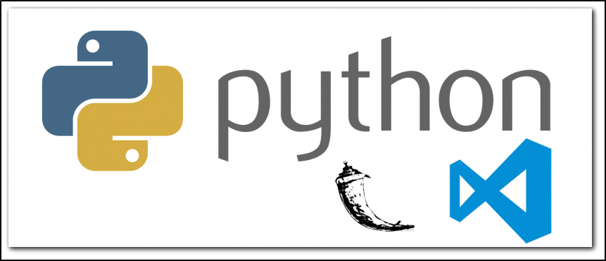

# Developing Web Applications with Flask

**Duration:** 2 days

## Overview

Flask Training: ***Developing Web Applications with Flask*** course teaches Python developers to create professional web applications with the Flask micro-framework.

## Software Needed on Each Student PC

* Any Windows, Linux, or macOS operating system
* Python 3.x installed with PIP 3
* Postman (https://www.postman.com)
* A text editor or IDE (VS Code or PyCharm Community Edition recommended)
* Git (Optional)

## Objectives

* Create complete Flask applications
* Design Jinja templates
* Integrate a SQLite/MySQL database
* Test and debug Flask applications

## Outline:

### DAY-1 (Basics + Simple Web Applications)

* Introduction to Web Applications (MVC)
* Virtual Environments
* Flask Installation (venv)
* Create First Flask Application
* Create Routes
* Testing with Postman
* Templates
* Create Sample Flask Apps
* Database Integration with flask-sqlalchemy
* Create Sample Flask Apps

#### Outcomes

* Understanding purpose of Flask Framework
* Writing sample projects
* Testing a Flask Application
* Debugging a Flask Application
* A realtime understanding of Web Apps
* Understanding the pirpose of Micro-Services

### DAY-2 (Create Web Applications + Try Web Apps from GitHub)

* Downloading any Flask App from Github
* Try to understand the application
* Try to enhance the application
* Quick look at Flask App Builder

#### Outcomes

* Learnt how to Debug a known open source Flask Application from Github
* Enhanced an existing open source Flask Application from Github

## Workshop Outcomes

Students by attenting workshop learnt about

* Purpose of Web Apps
* Writing web apps in Flask
* Enhance existing Flask Apps
* Analysing known Flask Apps (From Github)

#### Last Hour: 

A session for 

* Answering questions from students on Software (IT) career.

## Materials

* Useful documents are available in ***docs/material*** for students to learn/practice

## Using this repo
This repo or workshop completely created for students who want to learn python Flask. Feel free to share/distribute/modify this contents as you wish.

To start Flask coding click [Coding Steps](steps.md)