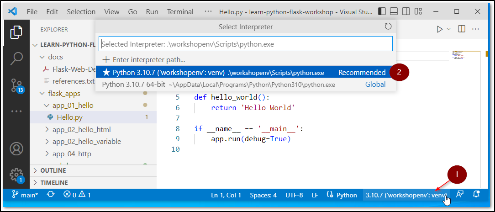

# Steps to Start Coding

* Clone or download the repository.
* Place the repository in a proper location.
* Extract if you download the repo as a ZIP
* Open a terminal (CMD) inside the repo (or folder).

    * **Note**: Do not close terminal till the last step.

* Create a Python Virtual Environment by running followig commands.

    ```bash
    python -m venv workshopenv

    workshopenv\scripts\activate
    ```

* In the same terminal run following command to install the Flask and required packages.

    ```bash
    pip install -r requirements.txt
    ```

* Open code editor.

    * If you are using Visual Studio Code, just run following command the terminal.

        ```
        code .
        ```

* Select Virtual Environment 'workshopenv' in your editor.

    * This should happen automatically. Better to check it once.
    * You need to select the Virtual Environment 'workshopenv' that got created in above steps.
    * Follow the two steps shown in the screenshot below.

        

# Run First Sample Flask Application

* In your editor (VS Code), go to flask_apps/app_01_hello/
* Click on Hello.py
* There are two way to run you flask app

    * Directly run your python file by clicking the play button
    * OR
    * Use following command in your terminal (Makure you switch to \flask_apps\app_01_hello)

        ```
        flask --app Hello run
        ```
    * You should see something like below

        ```
        Running on http://127.0.0.1:5000
        ```
  * Open browser and enter the above URL. You should see the 'Hello World' response.


**Happy Coding and All the Best**


