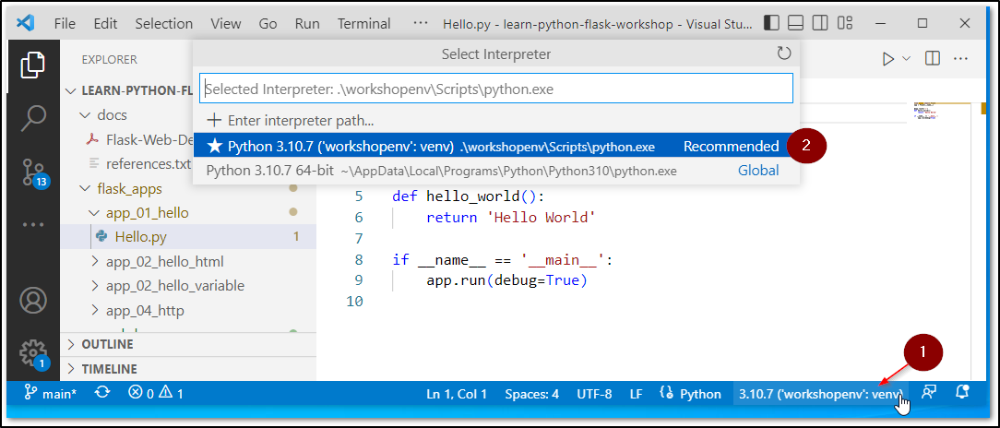

# Steps to Start Coding

* Clone or download the repository.
* Place the repository in a proper location.
* Open a terminal (CMD) in same location.

    * **Note**: Do not close terminal till the last step.

* Create a Python Virtual Environment by running followig commands.

    ```bash
    python -m venv workshopenv

    workshopenv\scripts\activate
    ```

* In the same terminal run following command to install the Flask and required packages.

    ```bash
    pip install -r requirements.txt
    ```

* Open code editor.

    * If you are using Visual Studio Code, just run following command the terminal.

        ```
        code .
        ```

* Select Virtual Environment in your editor.

    * You need to select the Virtual Environment 'workshopenv' that got created in above steps.
    * Follow the two steps shown in the screenshot below.

        

    